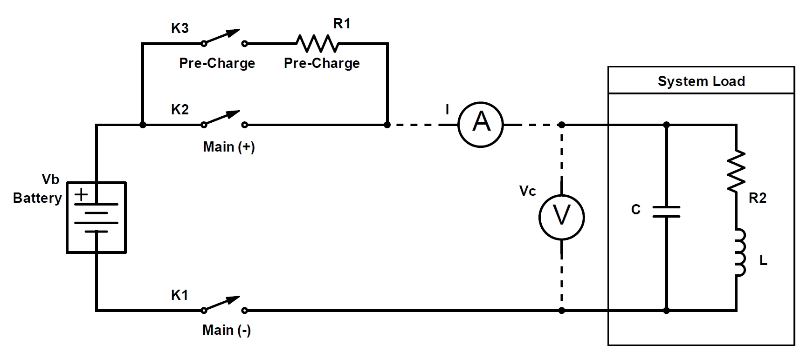
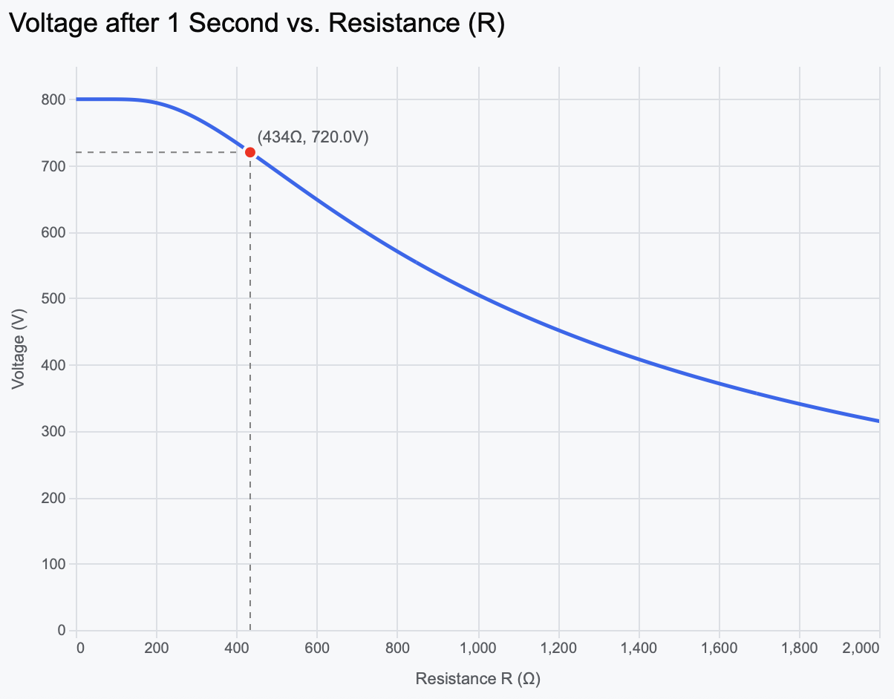
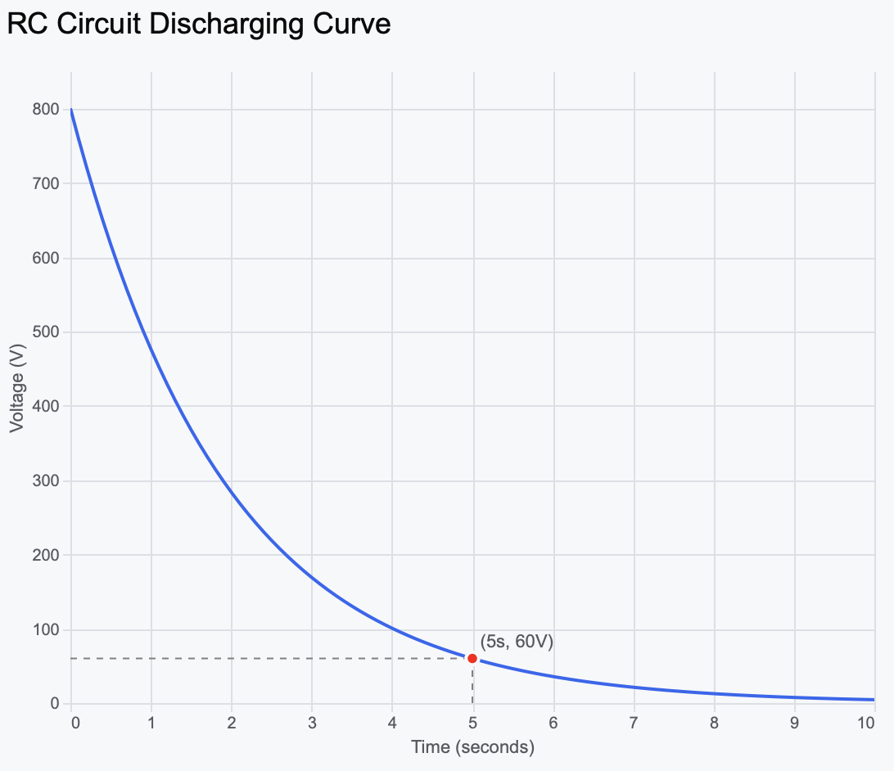
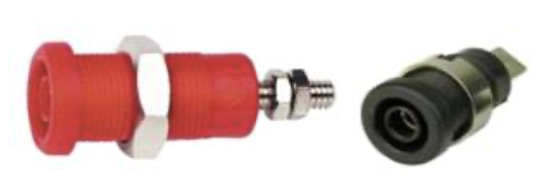

# 09.19 스터디

## AIR(Accumulator Isolation Relay, HV 릴레이) 및 관련 규정

* Kilovac EV200 AIR

---

기본적으로 배터리 팩과 구동 시스템 사이의 절연을 담당 (대형 릴레이)

Aux 리드 동작 방식에 따라 NO 및 NC 타입이 있음

코일을 이용해서 작동.
제품에 따라 처음 접점 붙일 때만 전류를 크게 쓰고(2A), 유지하는 데는 작은 전류만(500mA) 쓰는 기능이 있음.

---

관련 규정

SDC가 열리거나 중단된 경우 AIR가 개방되어야 함.

## SDC(Shutdown Circuit) 및 인터락

* 인터락 배선

* SDC 회로

SDC는 인터락, 비상정지버튼, IMD, BSPD 등 안전장치들이 직렬로 연결된 회로임.
이 회로는 전원이 없으면 기본적으로 열려서(NO) AIR 코일에 전류가 흐르지 않음.

AIR은 축전지 박스에 두 개 이상 장착되어야 함

AIR 및 초기 충전 릴레이는 기구적인 상태를 감지해야 함. 릴레이 제어신호를 이용할 수 없음. (Aux 리드를 사용하면 될 듯)

AIR 닫힌 상태에서 구동계 전압 60V DC 이상이면 적색 LED 점등

## Pre-Charge Circuit 및 관련 규정

돌입 전류: HV 시스템 대용량 커패시터 충전이 안 되어 있으면 축전지를 연결했을 때 순간적으로 높은 전류가 흐름. 이때 AIR 접점 및 인버터 등 손상될 수 있음.
$$
i = C \frac{dv}{dt}
$$

$\frac{dV}{dt}$를 낮추기 위해 Pre-charge 회로를 이용해서 커패시터를 천천히 충전시킴.

$$
\tau = R \times C
$$

$$1-e^{-\tau}$$
$$v(t) = V_s(1 - e^{-\frac{t}{\tau}})$$

* 저항 변화에 따른 HV 시스템 1초 후 전압

Pre-charge 릴레이 뒤에 저항 연결해서 전류를 낮춰 접점 등 보호함.

---

e.g. 1초 이내 1000 μF, 800V HV 배터리 전압의 90퍼센트가 목표라면,
$$0.9 \times 800 =800\times(1-e^{-\frac{1}{\tau}})\quad\tau\approx0.434$$
$$0.434= R \times 1000\mu F \quad R\approx 434\,\Omega$$

* $v_{1}(R) = 800\times(1 - e^{-\frac{1}{R\times0.001}})$

434옴의 저항을 사용(1초에 800 V의 90%인 720 V까지 충전). 그래프에서, 저항이 낮을수록 1초에 전압이 더 많이 상승함.

---

관련 규정

HV 릴레이(AIR) 2개가 모두 연결되기 전 1초 이상 구동시스템을 초기충전하여야 함.

AIR가 닫힌 경우 초기충전회로는 중단되어야 함. 차단회로가 개방된 경우에 초기충전회로가 작동하면 안 됨.

초기충전회로의 전원은 HV 비상정지스위치에서 직접 공급되어야 함. (AIR 코일처럼 SDC에 연결되어야 한다는 뜻인 듯)

## Discharge Circuit 및 관련 규정

AIR을 열었을 떄도 HV 시스템에 높은 전압이 남아 있음. 안전을 위해 빠르게 태워 버리는 회로.

Passive 방식과 Active 방식이 있음.

* Passive 방식: 고저항을 이용해서 항상 일정량 방전.

별도의 제어 필요 없지만, 주행 중에도 항상 일부분이 타버림. (방전율을 높이면 주행 중 에너지를 많이 태워버림.)

* Active 방식: 릴레이 등을 이용해서 AIR가 열렸을 때 방전 (normally closed 릴레이로, sdc 전원이 끊기면 자동으로 닫혀 방전 시작)

HV 시스템에 상시 연결되어 있지 않으므로 저저항을 사용해서 급속도로 방전 가능.

$$
V(t) = V_0 e^{-\frac{t}{RC}}
$$

* 커패시터의 방전 곡선

커패시터 용량인 C는 고정되어 있으므로 방전 회로 설계 시 저항 R을 조정하여 방전 속도를 조절할 수 있음. R이 작으면 $\frac{t}{RC}$가 $t$가 지남에 따라 빠르게 커지므로 전압이 빠르게 하강함.

$$
I(t) = \frac{V(t)}{R}
$$

* 옴의 법칙

$$
P(t) = \frac{V(t)^2}{R}
$$

* 전력

$R$이 작을수록 $I$가 커져 커패시터의 전하를 빠르게 비울 수 있고, 짧은 시간 안에 많은 에너지를 소모시킬 수 있음. 이때 대량의 열이 발생하므로, 저항을 선택할 떄 대전력을 견딜 수 있는 제품을 선택.

---

e.g.
커패시터 용량 500 𝜇F, 800 V 회로를 5초 이내로 60 V로 떨어뜨리는 경우
$$60 = 800\times e^{-\frac{5}{R\times0.0005}}\quad R\approx 3860.6\,\Omega$$
R을 3.8k 옴 또는 더 낮은 저항을 사용.

이때 최대 전류는
$$I_{max}\approx0.207\,A$$
5초 동안 발생하는 총 열은

$$\int_{0}^{5} \frac{(800\times e^{-\frac{t}{3860.6\times0.0005}})^{2}}{3860.6}\approx 159.1\,J$$

---

관련 규정

방전회로는 차단 회로가 개방되거나 차량에서 LV 전원이 차단되었을 때 항상 활성화되도록 설계되어야 함. 또한 고전압 분리기가(HVD) 분리되었을 때에도 방전될 수 있도록 설계되어야 함.

방전회로는 최소 15초 동안 최대 방전 전류를 처리하도록 설계해야 함. (LV 시스템 전원이 차단되면 HV 시스템도 즉시 비활성화되어야 함.)

## TSMP 및 관련 규정

외부에서 하우징을 열지 않고 LV 및 HV 전압을 측정할 수 있도록 설치된 단자. 검차 시 방전성능, IMD 등을 테스트하는 데 사용됨.

흑색, 적색의 4mm Banana Jack을 사용하고, 주황 배경에 HV+ HV- 등으로 표시되어야 함.

* 전류 제한 저항

1. Vmax <= 200 V DC: 5 kΩ
2. 200V DC < Vmax ≤ 400V DC: 10kΩ
3. 400V DC < Vmax ≤ 600V DC: 15kΩ

HV 단자 옆에 GLVS(접지) 단자가 설치되어야 함. 최소 3포인트 지지가 필요함.
