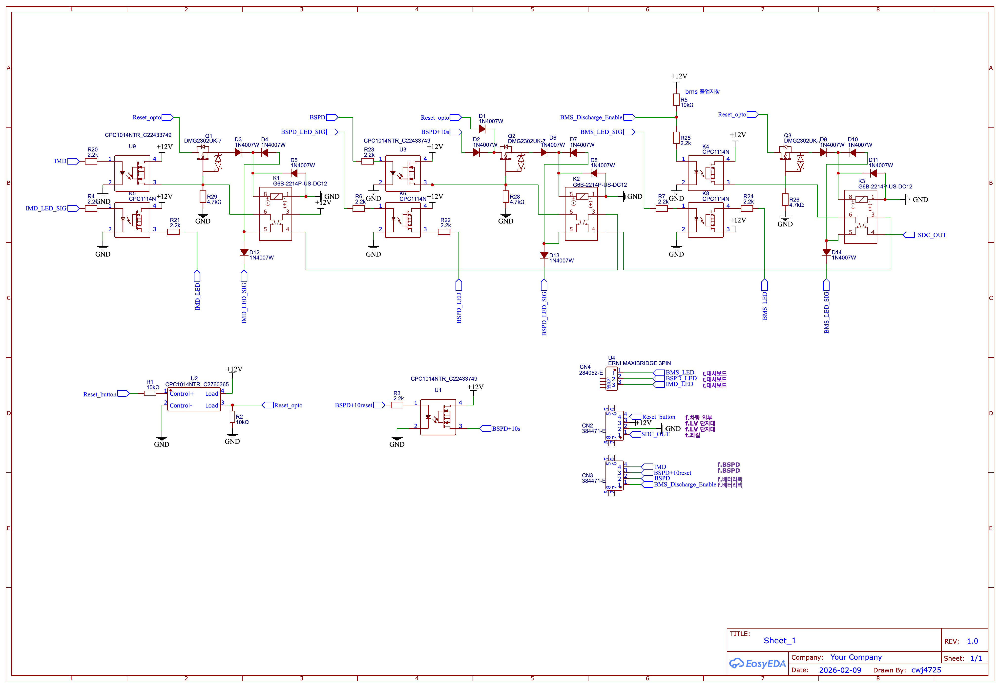
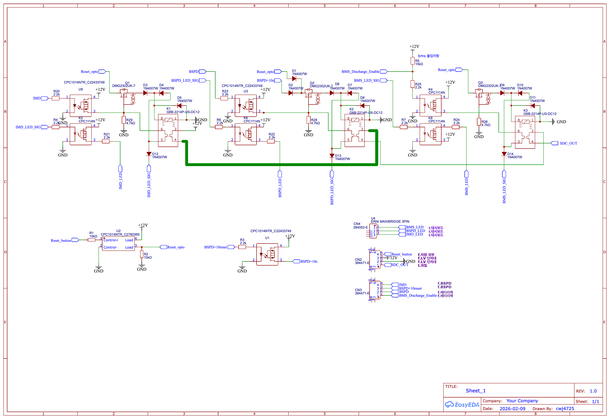
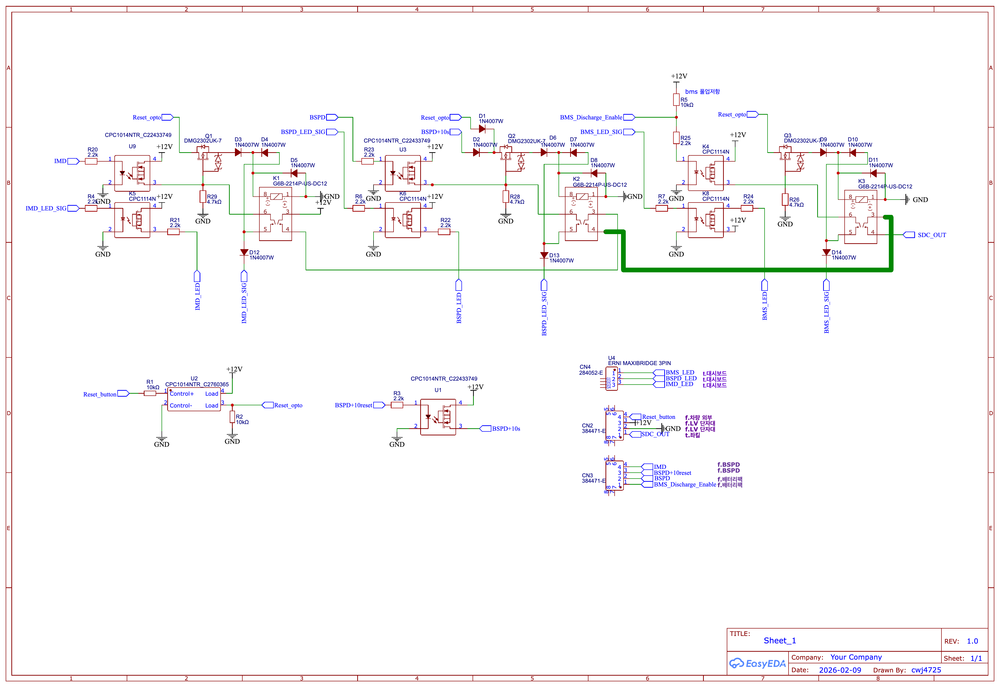
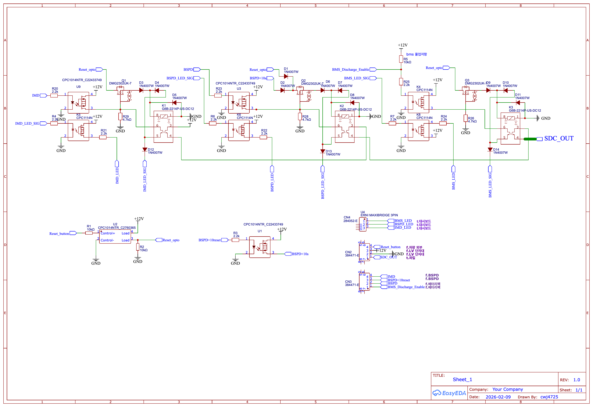

# 0922 스터디 - SDC 회로

## 관련 규정

* 드라이버는 BMS, IMD, BSPD, BOTS가 구동시스템을 비활성화시킨 상황을 제외하고는 외부 도움
없이 운전석 내에서 구동시스템을 활성화 할 수 있어야 한다.

* HV 릴레이를 (AIR) 작동시키는 전류와 초기 충전 회로를 작동시키는 전류는 차단 회로를 통해 직접
이동한다.

* 차단 회로는 최소 2개의 주 비상 정지 스위치, 3개의 보조 비상 정지 스위치, 제동장치 미작동 감지
장치(BOTS), BMS, IMD, BSPD, 필요한 모든 인터락(interlock)으로 구성되어야 한다.

* 접지된 저전압 시스템의(GLVS) 전원이 차단되면 구동시스템은 즉시 비활성화되어야 한다.

* 차단 회로가 열리거나 중단된 경우에 다음의 조건을 만족해야 한다.

```text
1. 즉시 모든 HV 릴레이를 개방하여 구동시스템을 비활성화해야 한다.
2. 초기 충전 릴레이를 포함한 제66조의 AIR를 모두 개방하여 즉시 모든 축전지 전류 흐름이 중단되어야 한다.
3. 차단 회로를 개방한 후 5초 이내에 구동시스템의 전압이 저전압 기준 미만으로 낮아져야 한다.
```

* BMS, IMD, BSPD에 의해 차단 회로가 개방된 경우

```text
1. 구동시스템은 수동으로 재설정(RESET) 하기 전까지 비활성화 상태를 유지해야 한다.
2. 드라이버는 차량 내부에서 구동시스템을 재활성화할 수 없어야 한다.
3. 보조 비상정지 스위치 또는 주 비상정지 스위치의 작동만으로 차단 회로의 재설정이 이루어져서는 안된다(별도의 재설정(RESET) 버튼 필요).
4. 구동시스템은 차량 외부의 인원에 의해서만 재설정(RESET) 되어야 한다.
5. 재설정 버튼은 차량 외부에 위치하며, 드라이버가 작동할 수 없는 위치에 있어야 한다.
```

* 차단 회로에 포함된 모든 회로는 전원이 차단된 상태에서 개방되도록 설계해서 각 회로가 HV 릴레
이를(AIR) 제어하는 전류를 제거하도록 한다.
* 차단 회로의 모든 기능이 올바르게 작동함을 입증할 수 있어야 한다.

## IMD 회로



* 전체 Schematic



* IMD가 정상인 경우



* IMD & BSPD가 정상인 경우



* IMD & BSPD & BMS가 정상인 경우

## 평상시 동작

* [정상작동](ready.mp4)

릴레이가 통과시켜준 전류를 자기 코일로 다시 받아서, 스스로 열린 상태를 유지. 이때 IMD 등의 신호가 끊기는 경우, 접점이 열려 외부 도움 없이 다시 접점을 복귀시킬 수 없음. (자기유지, Self-holding or Self-latching)

* [이상이 생긴 경우](emergency.mp4)

IMD의 신호가 끊긴 경우, 코일을 작동하던 전류가 없어지므로 코일이 열린다. 열린 코일은 외부에서 다시 붙이지 않을 때까지 IMD 신호가 통과하지 못한다.

* [다시 켜는 경우](reset.mp4)

IMD의 신호로는 다시 릴레이를 닫을 수 없으므로, 코일과 연결된 리셋 버튼으로 회로를 열워줘야 함.
