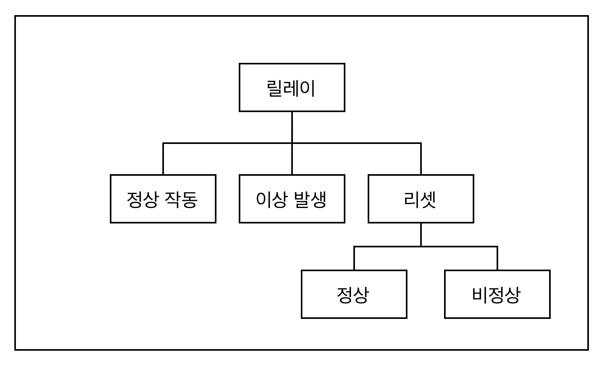
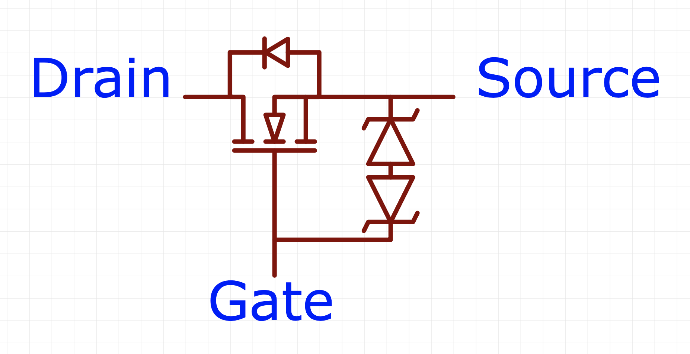
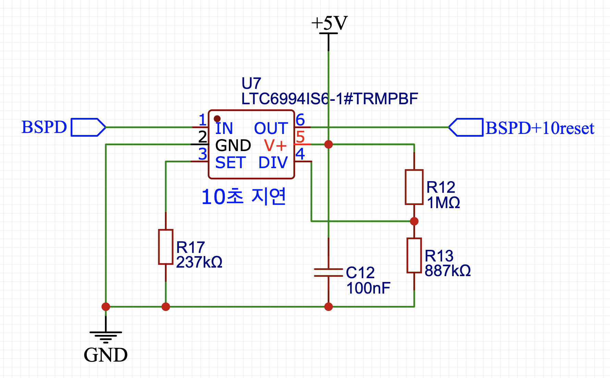
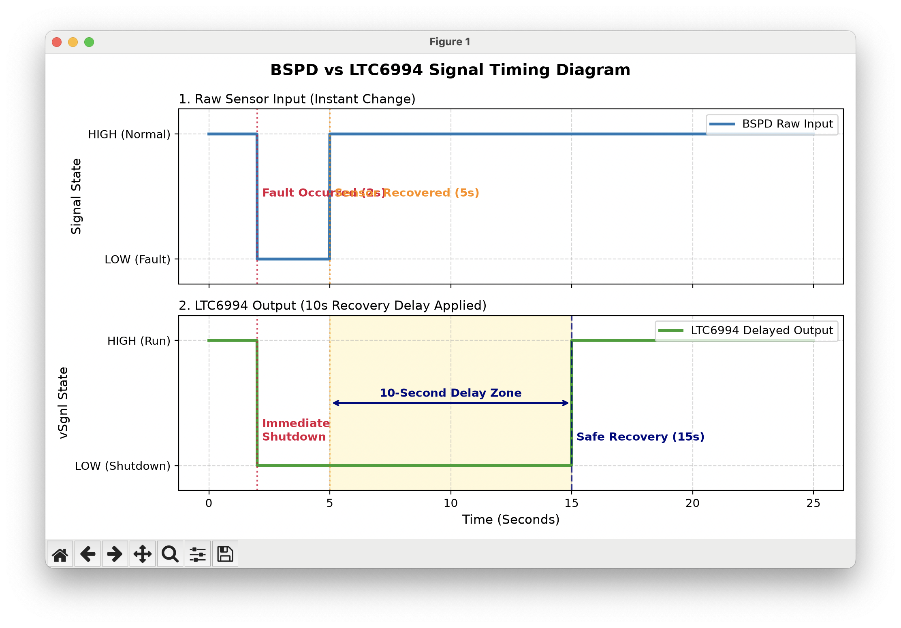
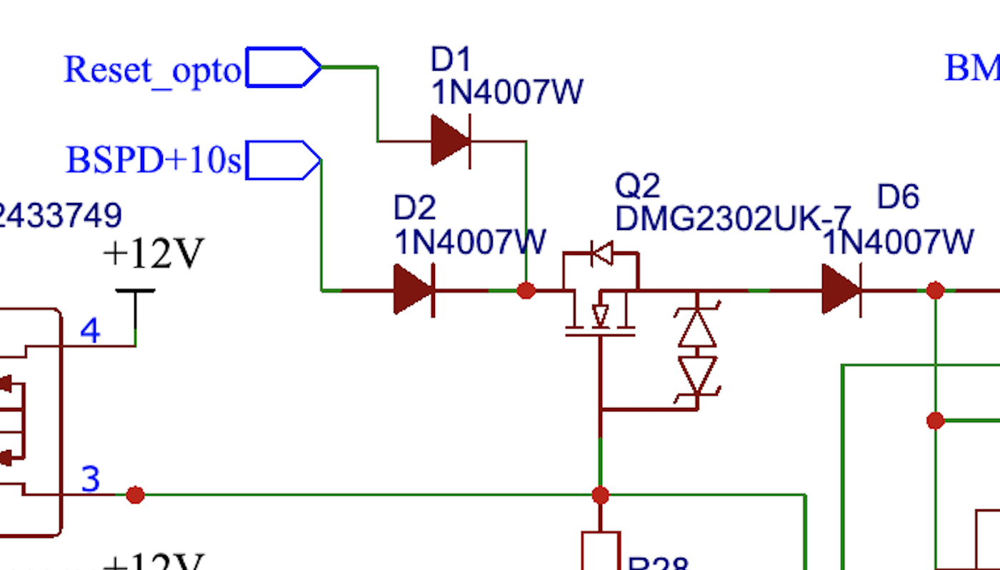
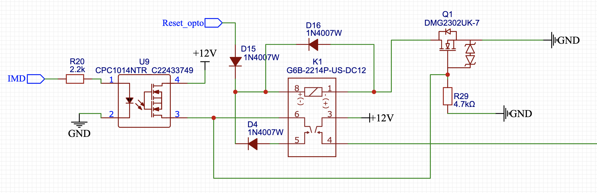

# 0922 스터디 - SDC 회로

## 관련 규정

* 드라이버는 BMS, IMD, BSPD, BOTS가 구동시스템을 비활성화시킨 상황을 제외하고는 외부 도움
없이 운전석 내에서 구동시스템을 활성화 할 수 있어야 한다.

* HV 릴레이를 (AIR) 작동시키는 전류와 초기 충전 회로를 작동시키는 전류는 차단 회로를 통해 직접
이동한다.

* 차단 회로는 최소 2개의 주 비상 정지 스위치, 3개의 보조 비상 정지 스위치, 제동장치 미작동 감지
장치(BOTS), BMS, IMD, BSPD, 필요한 모든 인터락(interlock)으로 구성되어야 한다.

* 접지된 저전압 시스템의(GLVS) 전원이 차단되면 구동시스템은 즉시 비활성화되어야 한다.

* 차단 회로가 열리거나 중단된 경우에 다음의 조건을 만족해야 한다.

```text
1. 즉시 모든 HV 릴레이를 개방하여 구동시스템을 비활성화해야 한다.
2. 초기 충전 릴레이를 포함한 제66조의 AIR를 모두 개방하여 즉시 모든 축전지 전류 흐름이 중단되어야 한다.
3. 차단 회로를 개방한 후 5초 이내에 구동시스템의 전압이 저전압 기준 미만으로 낮아져야 한다.
```

* BMS, IMD, BSPD에 의해 차단 회로가 개방된 경우

```text
1. 구동시스템은 수동으로 재설정(RESET) 하기 전까지 비활성화 상태를 유지해야 한다.
2. 드라이버는 차량 내부에서 구동시스템을 재활성화할 수 없어야 한다.
3. 보조 비상정지 스위치 또는 주 비상정지 스위치의 작동만으로 차단 회로의 재설정이 이루어져서는 안된다(별도의 재설정(RESET) 버튼 필요).
4. 구동시스템은 차량 외부의 인원에 의해서만 재설정(RESET) 되어야 한다.
5. 재설정 버튼은 차량 외부에 위치하며, 드라이버가 작동할 수 없는 위치에 있어야 한다.
```

* 차단 회로에 포함된 모든 회로는 전원이 차단된 상태에서 개방되도록 설계해서 각 회로가 HV 릴레
이를(AIR) 제어하는 전류를 제거하도록 한다.
* 차단 회로의 모든 기능이 올바르게 작동함을 입증할 수 있어야 한다.

## IMD 회로


* 전체 Schematic


* IMD가 정상인 경우


* IMD & BSPD가 정상인 경우


* IMD & BSPD & BMS가 정상인 경우

## 릴레이의 동작



정상적으로 운행하는 경우, 시스템에 이상이 생긴 경우, 리셋하는 경우로 나눔. 리셋은 이상이 해결된 경우, 이상이 해결되지 않은 경우로 나눔.

---

* [정상작동](ready.mp4)

릴레이가 통과시켜준 전류를 자기 코일로 다시 받아서, 스스로 닫힌 상태를 유지. 이때 IMD 등의 신호가 끊기는 경우, 접점이 열려 외부 도움 없이 다시 접점을 복귀시킬 수 없음. (자기유지, Self-holding or Self-latching)

* [이상이 생긴 경우](emergency.mp4)

IMD의 신호가 끊긴 경우, 코일을 작동하던 전류가 없어지므로 릴레이가 열린다. 열린 릴레이는 외부에서 다시 붙이지 않을 때까지 IMD 신호가 통과하지 못함.

* [다시 켜는 경우](reset.mp4)

IMD의 신호로는 다시 릴레이를 닫을 수 없으므로, 코일과 연결된 리셋 버튼으로 회로를 닫아줘야 함.

## MOSFET



Gate에 전압을 걸어 주면, Drain에서 Source로 전류가 흐름.

| Gate | Drain | Source |
| --- | --- | --- |
| LOW | LOW | LOW |
| HIGH | LOW | LOW |
| LOW | HIGH | LOW |
| HIGH | HIGH | HIGH |

LEF-26 SDC에서는 전압을 적절하게 걸어 AND 게이트처럼 사용한 것 같음. 이 경우 부하가 Source 뒤에 있으면 High-side, Drain 앞에 있으면 Low-side임.

## RESET

### IMD가 정상인 경우(IMD 신호가 들어오는 경우)

* [IMD 정상](imd_normal.mp4)

IMD 신호가 정상이면, 게이트에 전압이 걸리고, 리셋 신호를 통과시킬 수 있음. 이때 리셋 버튼을 누르면, Drain에서 Source를 거쳐 코일에 전압이 걸리고, 릴레이가 닫힘. 이때부터 5번 핀이 코일의 전압을 유지하기 때문에 리셋 신호가 더이상 들어오지 않아도 닫힌 상태를 유지.

### IMD가 비정상인 경우(IMD 신호가 들어오지 않는 경우)

* [IMD 비정상](imd_fail.mp4)

IMD 신호가 비정상이면(LOW이면), 게이트에 전압이 안 걸리고, 리셋 신호를 통과시킬 수 없음. 이때 리셋 버튼을 눌러도, MOSFET에서 막히기 때문에, 코일을 닫을 수 없음. IMD가 비정상 상태일 때 SDC가 닫히는 것을 막음.

## BSPD 10초 규정

BSPD가 이상을 감지하고 10초 이상 지난 후에, 별도 리셋 버튼을 누르지 않고도 스스로 정상 상태로 돌아올 수 있음.



LTC6994-1 지연 블럭은, 저항 연결에 따라 전압이 상승할 때 또는 하강할 때를 골라 지연시킬 수 있음. BSPD가 정상일 때 HIGH라면, 순간적인 이상이 감지되었을 때 HIGH -> LOW 신호는 즉시 보내고, 복구되는 LOW -> HIGH 신호는 10초 지연시켜 출력함.



사진에서, BSPD 신호가 복구되어(5초 지점) HIGH로 돌아온 후 10초 지연되어 BSPD+10RESET 신호가 출력(15초 지점)되는 것을 확인할 수 있음.



SDC에서는 이 규정을 반영하여, Reset_opto 또는 BSPD+10s 신호 둘 중 하나만 들어오더라도 릴레이를 닫는 로직이 구현되어 있음.

## 개선사항



* [Falstad 시뮬레이션](falstad_sdc_lowside.mp4)

Source 뒤쪽에 코일이 연결되어 있는 High-side 구조 회로를 Low-side 회로로 변형시킨 회로임. MOSFET에서 Gate가 열리기 위해서, Gate는 Source보다 높은 전압을 받아야 하는데, High-side 구조는 Source가 부하(릴레이 코일) 전에 위치하기 때문에 전압이 높음. 이때 Gate 전압이 충분하지 않다면, MOSFET이 켜지지 않을 가능성이 있음. Low-side에서 Source를 Ground에 직결하면, Source 전압이 0V이므로 문제가 발생할 가능성이 낮음.

Low-side 구조만을 반영해서 만든 회로이기 때문에, 코일의 역기전력 Flyback 다이오드 등의 설계에 오류가 있을 수 있고, 전 대회에서 기존 설계대로 만들 수밖에 없었던 규정 및 기술적 배경이 존재할 수 있음.

대표적으로, Low-side 구조의 경우 1번 핀과 MOSFET 사이의 전선이 Ground와 단락되는 경우, 릴레이가 항상 닫히게 되어 IMD에 문제가 발생하더라도 SDC가 차단되지 않을 수 있음. 따라서 추가적인 벤치마킹 및 스터디를 통해 기존 설계와 비교하여 Low-side 구조를 채택할지 결정해야 함.
