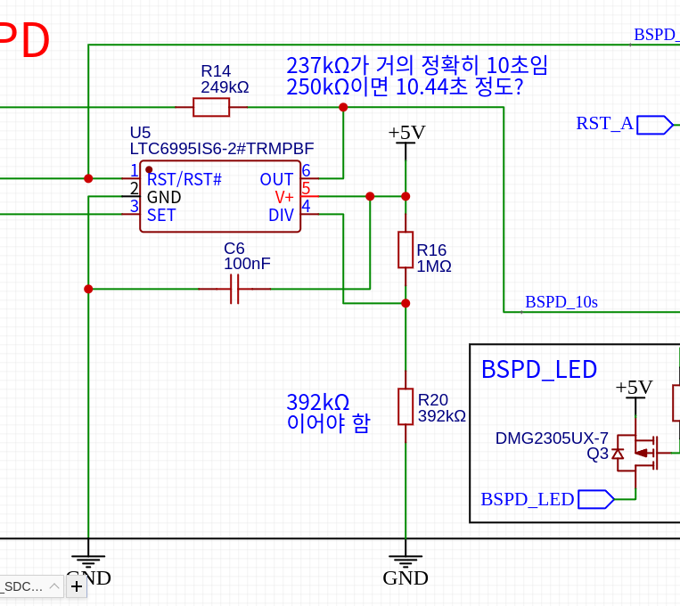
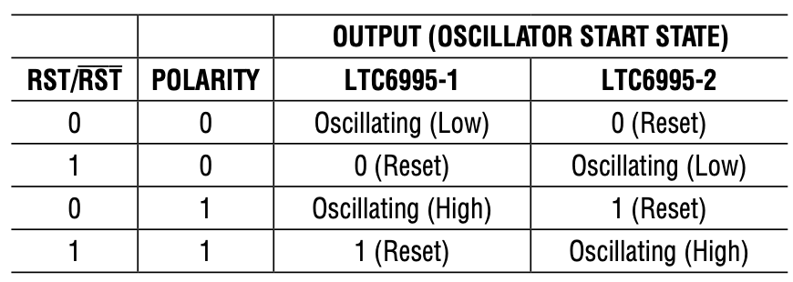
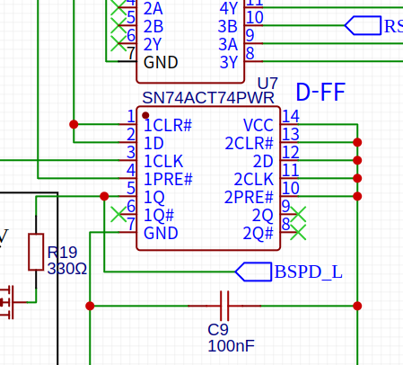
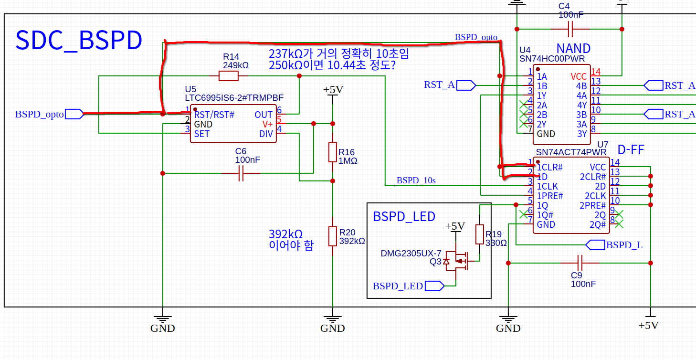
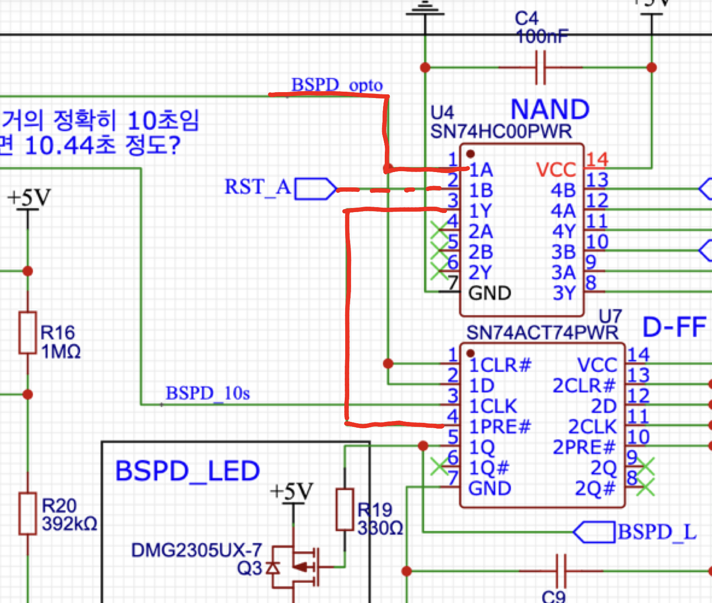
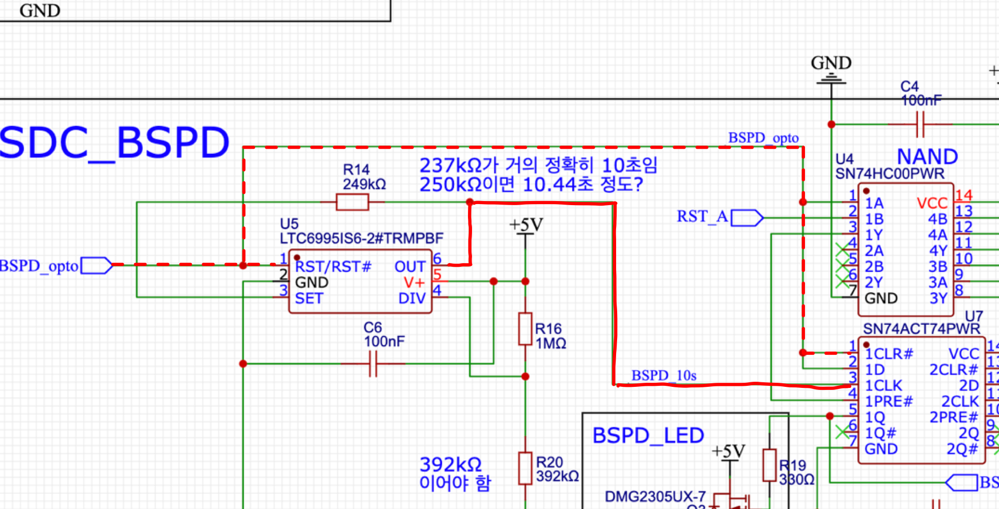
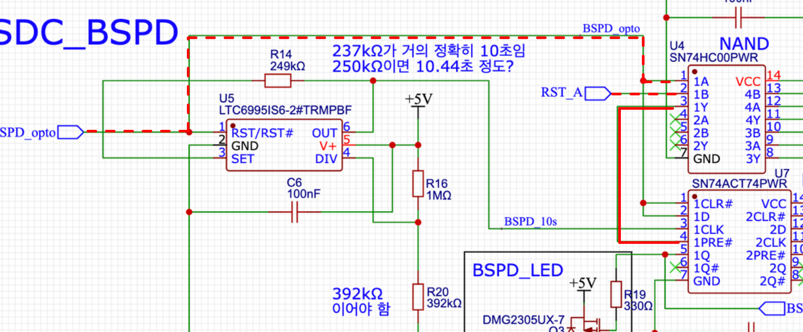
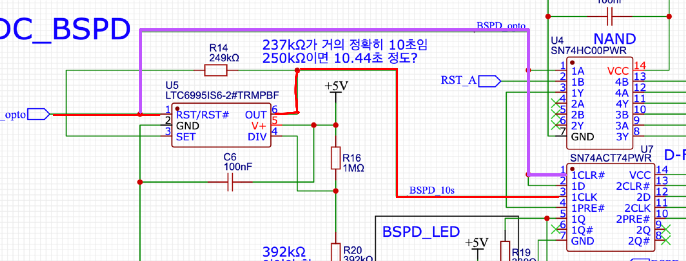
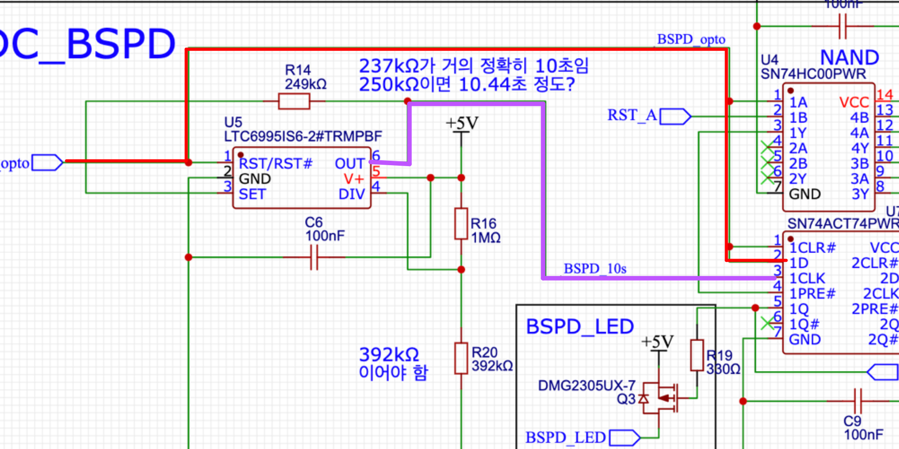
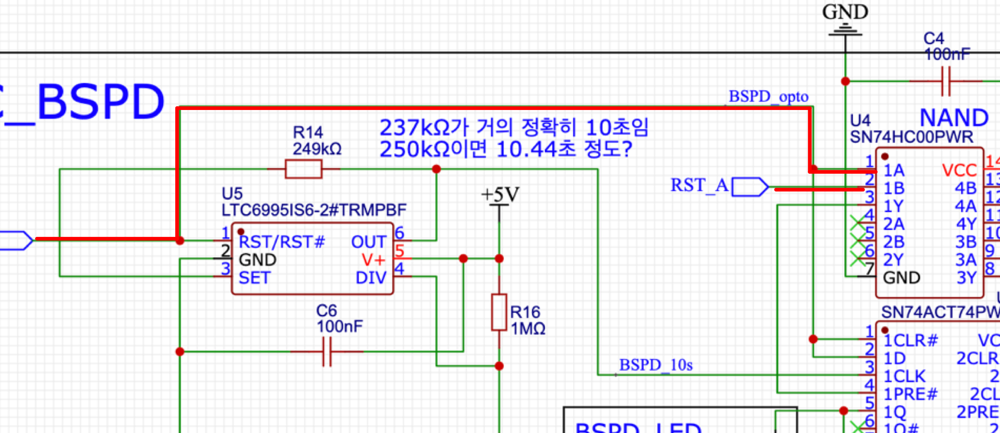

# 0930 스터디 - 25 EVO SDC-BSPD 회로

Normal HIGH, Fault LOW

## LTC6995 동작

RST LOW면 OUT HIGH 유지하다가, RST HIGH인 순간 카운팅 시작 - HIGH 유지하다가 반 주기 지나면 LOW로 내려감. (6995-2 Active-Low)

V+와 DIV 핀의 전압차이로 시간 구간을 먼저 정하고, (현미경의 조동나사), SET에 들어가는 전류로 미세 조정

정확한 값은 지금 할 건 아닌 거 같고, 나중에 소자 정하고 데이터시트 보면서 조정해나가면 될 듯.

## D-플립플롭 동작

간단하게 하기 위해서 Mode가 있다고 설명. 변재현씨가 말했듯 기본적인 DFF는 CLR(Clear)이나 PRE(Preset)가 없음.

CLR/PRE 모드와 DFF 모드 2개로 나뉜다고 생각해봄. CLR, PRE 모두 HIGH일때는 DFF모드로 동작.

CLR, PRE 하나라도 HIGH이면 Async 모드로 동작.

DFF모드일 때는, CLK 핀에 엣지가 걸릴 때, D의 값을 그대로 Q에 저장하고 그대로 내보냄. 다음 엣지 전까지 Q 값은 유지됨. Ctrl-C라고 생각하면 될 듯.

Async 모드일 때는, DFF 모드일 때 상태를 무시함. CLR/PRE 핀들은 0일 때 켜진 거라고 생각하면 됨. CLR이 0이면 Q가 0으로 고정이고, PRE가 0이면 Q가 1로 SET 됨. CLR/PRE가 모두 HIGH로 돌아가서 Async 모드가 끝나고 다시 DFF 모드로 돌아가면, Q는 유지됨.

## NAND 동작

AND 게이트 뒤에 NOT 붙인 것임. 정상 시 RST 버튼 누르면 PRE를 통해 SDC를 복구시키는 역할. 리셋 버튼을 누르지 않는 한 LOW(PRE 동작 조건)이 될 수 없으므로 리셋 버튼 상황에서만 생각하면 됨.

## SDC의 동작

정상
폴트(폴트 1초 후 복귀)/폴트시 리셋
리셋 버튼/리셋 10초후

크게 정상, 폴트, 리셋 상황으로 나누고, 다시 폴트랑 리셋은 2개로 나눠서 설명.

## 정상일 때

정상일 때 CLR, D HIGH

NAND는 하나만 HIGH이므로 출력이 LOW - PRE HIGH

* CLR, PRE가 모두 HIGH(기능 off)이므로 DFF 모드. CLK에 엣지가 발생하기 전까지 Q 상태를 보존함. 정상 주행이라면, 타이머가 작동해서 10초마다 엣지가 발생하지만 D가 HIGH이므로 Q는 HIGH 유지.

NOTE: 저번에 변재현씨가 설명했듯, 이 순간에 D와 CLK가 동시에 켜지므로, Q가 이것만으로는 HIGH라고 보장되지 않는다. POR 등으로 켜 줘야 함.

## 폴트

### 폴트 발생 시 및 1초 경과후 복귀

폴트 발생 시 CLR LOW 됨. Async 모드.
PRE가 LOW가 아니라면 즉시 Q가 LOW(Fault) 출력. 타이머 출력은 RST가 HIGH(작동조건 HIGH)라서 계속 HIGH임(엣지 없음)
OUT은 HIGH. Async 상태라서 CLK에 꽂히는 OUT HIGHLOW는 별 상관없긴함.

PRE가 뭔지 확인해보기.

NAND에서 A, B 모두 LOW 이므로 출력은 여전히 HIGH - CLR이 0, PRE가 1이므로 Q는 LOW(Fault)으로 확정.

타이머가 10초 후 LOW로 내려가므로, 그 전까지 특별한 이벤트 없는 한 이 상태를 유지.

### 폴트 1초 후 복귀

아까 폴트 상태에서 타이머는 HIGH를 유지하므로, 지금 시점에서는 여전히 HIGH. BSPD가 복구된 경우(지금) RST이 HIGH이므로 OUT 신호는 여전히 HIGH. (엣지 없음)

CLR 핀이 LOW로 가면서 다시 DFF 모드, 아까 폴트 상황에서 CLR이 Q를 LOW로 내림. Q LOW 그대로 유지

이떄 타이머의 RST이 10초 카운팅을 시작. 10초 후 LOW로 갈 예정

## 리셋

### BSPD 복구 후 10초 경과

* 보라색 라인이 엣지됨 - 빨간색에 이어진 D의 HIGH 신호를 Q가 출력

CLR, PRE가 모두 1이라서 DFF 모드이면서, Q는 LOW인 상황. 복구된 BSPD에서 D에 HIGH를 보내 주고 있음. 타이머는 진행 중. 10초가 되는 순간 타이머의 OUT이 LOW로 떨어지면서 엣지가 발생하고, D(HIGH)의 값을 Q로 출력하기 시작하면서 정상 상태로 돌아온다.

### RST 버튼

RST 버튼이 눌리면서 DFF의 PRE에 0이 꽂히고, DFF에 1이 강제로 저장됨.

* BSPD가 복구되면 일단 D에는 HIGH가 꽂히고, 타이머는 CLK을 이용, RST 버튼은 PRE을 이용해서 복구시킴.

### if 폴트 시 리셋 버튼을 누르면?

BSPD가 LOW이므로, 평상시 NAND 출력과 다르지 않음 - PRE에 0이 안들어감
